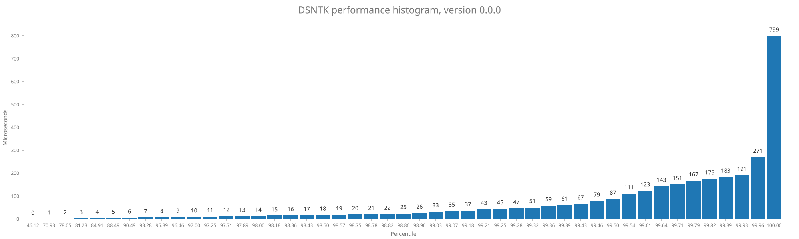

# DSNTK performance report

### Version v0.1.0

Total number of samples: **3527**

| Statistic |   Time |
|----------:|-------:|
|       Min |   0 µs |
|       Max | 927 µs |
|      Mean |   2 µs |
|    StdDev |  20 µs |

Percentage of samples executed in less than specified time

| Percentage |   Time | Samples |
|-----------:|-------:|:--------|
|      60.5% |   0 µs | 2133    |
|      79.4% |   1 µs | 2800    |
|      84.1% |   2 µs | 2966    |
|      88.9% |   3 µs | 3135    |
|      92.1% |   4 µs | 3247    |
|      95.2% |   5 µs | 3357    |
|      96.7% |   6 µs | 3410    |
|      97.1% |   7 µs | 3426    |
|      97.2% |   8 µs | 3428    |
|      97.4% |   9 µs | 3436    |
|      97.7% |  10 µs | 3446    |
|      98.1% |  11 µs | 3461    |
|      98.2% |  12 µs | 3463    |
|      98.2% |  13 µs | 3464    |
|      98.3% |  14 µs | 3467    |
|      98.4% |  15 µs | 3469    |
|      98.4% |  17 µs | 3470    |
|      98.4% |  18 µs | 3471    |
|      98.5% |  21 µs | 3473    |
|      98.5% |  23 µs | 3475    |
|      98.7% |  24 µs | 3481    |
|      98.8% |  25 µs | 3486    |
|      98.9% |  26 µs | 3487    |
|      99.0% |  27 µs | 3490    |
|      99.0% |  28 µs | 3493    |
|      99.1% |  29 µs | 3494    |
|      99.2% |  30 µs | 3498    |
|      99.2% |  31 µs | 3499    |
|      99.3% |  33 µs | 3502    |
|      99.3% |  35 µs | 3504    |
|      99.4% |  37 µs | 3505    |
|      99.4% |  41 µs | 3507    |
|      99.5% |  45 µs | 3508    |
|      99.5% |  49 µs | 3509    |
|      99.5% |  51 µs | 3510    |
|      99.5% |  57 µs | 3511    |
|      99.6% |  75 µs | 3512    |
|      99.6% |  83 µs | 3513    |
|      99.6% |  87 µs | 3514    |
|      99.7% |  95 µs | 3516    |
|      99.7% |  99 µs | 3517    |
|      99.8% | 107 µs | 3519    |
|      99.8% | 115 µs | 3520    |
|      99.8% | 119 µs | 3521    |
|      99.9% | 123 µs | 3523    |
|      99.9% | 143 µs | 3524    |
|      99.9% | 231 µs | 3525    |
|     100.0% | 575 µs | 3526    |
|     100.0% | 927 µs | 3527    |

